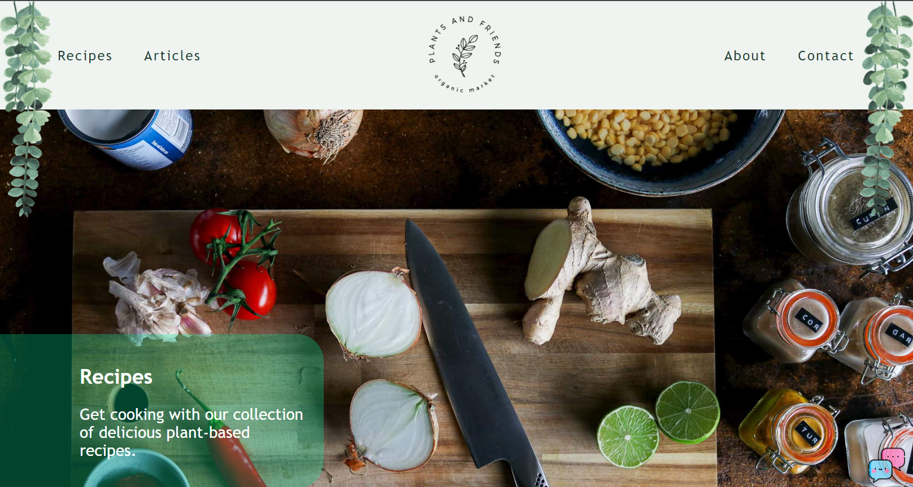

# Company Project
### Introduction

This is a simple layout for a company’s homepage. This page was developed to have responsive desing. The "About" page is also implemented and some pictures and buttons have some hover effects. 

Contents
========

 * [Why?](#why)
 * [How To Use?](#how-to-use)
 * [Technologies](#technologies)
 * [Project status](#project-status)

 
 ## Why?
 
 I wanted to practice my knowledge of CSS, HTML and responsive desing.
 
 <a href="https://alessandramorita.github.io/Company_Project/" >
  
</a>

 Or you can also view the live page **[here](https://alessandramorita.github.io/Company_Project/)**.
 
 ## How To Use?
 
 ```bash
# Clone this repository
$ git clone https://github.com/AlessandraMorita/Company_Project.git

# Go into the repository
$ cd Company_Project
```

## Technologies

* HTML
* CSS

## Project status

The project is still being developed. Next challenges:

* Add more pages
